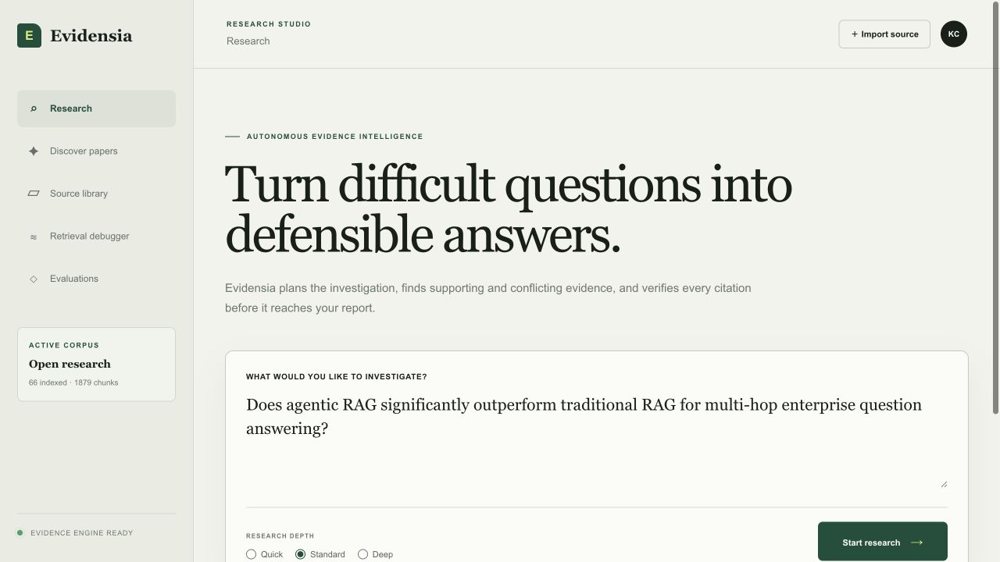
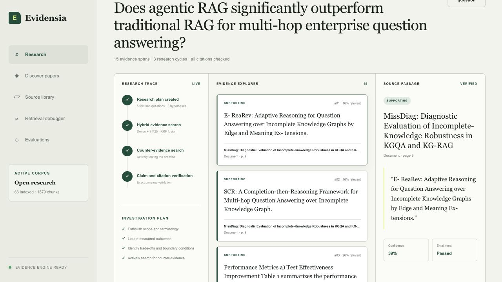
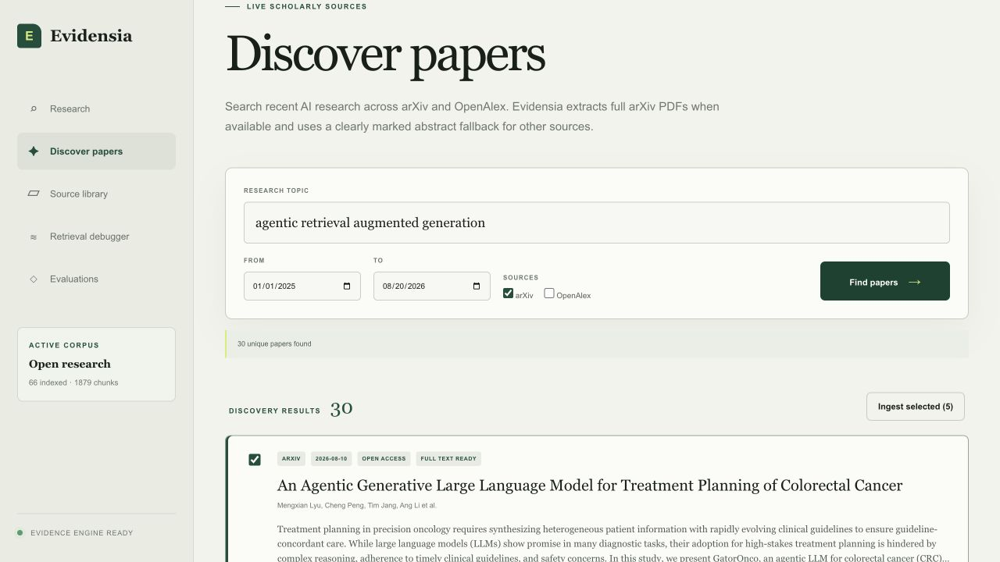
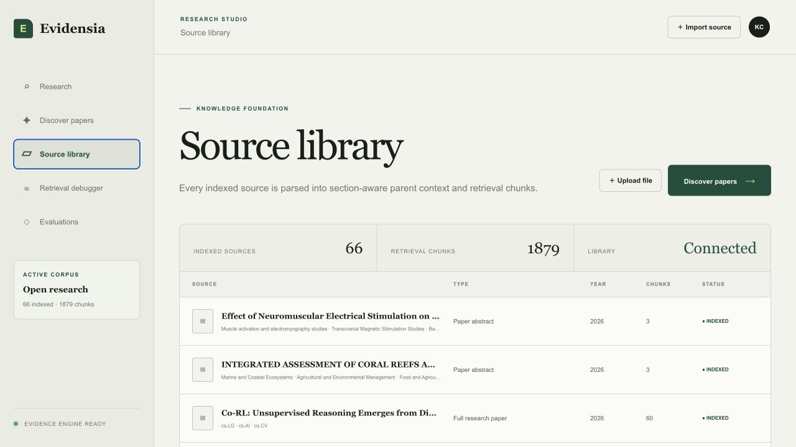
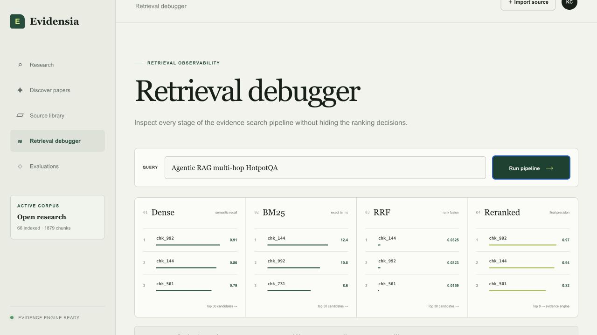
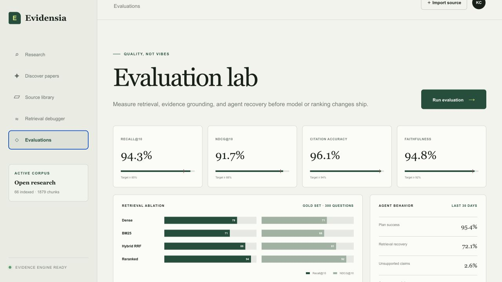

# Evidensia AI

**Turn an open research question into an answer whose every claim can be traced
back to the exact passage that supports it.**

Evidensia finds the papers, reads them, argues with itself about what they
actually show, and refuses to assert anything it cannot cite.

[](docs/assets/evidensia-end-to-end-flow.svg)

## What we are doing

A researcher asks a question in plain language. Evidensia then:

1. **Searches** arXiv, OpenAlex, Semantic Scholar, and Crossref for relevant papers.
2. **Ingests** them — parsing, extracting metadata, and splitting each into
   section-aware parent context and retrieval spans.
3. **Plans** the investigation, decomposing the question into sub-questions and,
   deliberately, counter-evidence targets.
4. **Retrieves** with dense vectors and BM25, fuses the rankings, and reranks.
5. **Assesses** whether the evidence is actually sufficient — coverage, source
   diversity, contradiction coverage — and rewrites its own queries when it is not.
6. **Synthesizes** claims from bounded evidence packets, each tied to specific
   source spans.
7. **Verifies** every citation, and reports what failed rather than hiding it.

The output is a report where each claim carries its sources, its confidence, and
its verification result — including the claims that did not survive checking.

## Why we are doing it

Retrieval-augmented systems are very good at producing confident, fluent,
well-cited-looking answers. They are much less good at being *right*, and the
failure is close to invisible: a plausible paragraph with a real citation
attached to it looks identical whether or not the cited source says what the
paragraph claims.

Three design commitments follow from that, and they shape the whole codebase:

**Verification has to be able to fail.** A citation check that cannot return
"this source does not support this claim" is decoration. Evidensia's verifier
returns a real verdict, and claims whose citations all fail are marked
unsupported and dropped from the findings rather than quietly kept.

**The system must actively look for disconfirming evidence.** Planning includes
counter-evidence targets by construction, and the sufficiency gate scores
contradiction coverage. A search that only finds agreement is treated as an
incomplete search, not a strong result.

**Degradation must be visible.** Every model-backed stage falls back to a
deterministic implementation when a provider fails, which keeps a run alive
during an outage — but a fallback that looks like success is worse than an
error. `GET /v1/research/{run_id}/diagnostics` reports whether the reasoning
model actually served a run or the run quietly ran on heuristics.

## Who benefits

| Audience | What they get |
|---|---|
| **Researchers and graduate students** | A literature review that surfaces contradicting findings instead of confirming a prior, with every claim traceable to a page and passage. |
| **Evidence and policy analysts** | Defensible answers with an auditable trail — the exact quoted span behind each claim, and an explicit record of what could not be verified. |
| **Applied RAG engineers** | A reference implementation where every retrieval stage is inspectable, four pipelines can be ablated against a gold set, and provider seams are swappable without touching API contracts. |
| **Anyone evaluating retrieval quality** | An evaluation harness that distinguishes "scored zero" from "could not be scored", and a retrieval debugger that shows dense, sparse, fused, and reranked stages separately. |

Phases 5 (production infrastructure) and 7 (large-scale deployment) from the
source design are intentionally deferred.

## The Research Studio

### Ask a question

The studio opens on the question itself. Depth selects how many correction
cycles the agent may spend before it must answer with what it has.



### Watch the run, then read the evidence

The trace on the left is driven by real Server-Sent Events from the research
graph, not a progress animation. The evidence explorer in the middle lists every
retrieved span with its stance — supporting or contradicting — and the panel on
the right shows the exact source passage behind the selected claim, with its
confidence and entailment result.



### Discover papers

Search four scholarly sources over a bounded date range. Results are normalized,
ranked, and deduplicated across providers before anything is downloaded.



### Source library

Every indexed document, its extracted metadata, and its retrieval chunk count.



### Retrieval debugger

Dense, BM25, fused, and reranked shown as separate stages, so a ranking decision
can be attributed to a specific component instead of inferred from the final
order.



### Evaluation lab

Score a gold set across all four pipelines at once. Reading them together is the
point: BM25 does not depend on the embedding provider, so it acts as a control —
if the dense arm moves and sparse does not, the change is attributable to the
embeddings rather than to noise.



## How the code is laid out

| Module | Responsibility |
|---|---|
| `api.py` | FastAPI boundary — 33 routes, SSE streaming, CORS, provider manifest |
| `models.py` | Pydantic domain models; `StrictModel` forbids unexpected fields |
| `providers.py` | Provider protocols and environment-driven selection |
| `persistence.py` | SQLite store for runs, events, saved searches, collections |
| `graph/research.py` | The corrective LangGraph state machine |
| `agents/planner.py` | Question decomposition into sub-questions and counter-evidence targets |
| `agents/evidence.py` | Span extraction and stance labelling |
| `agents/sufficiency.py` | Coverage, diversity, and contradiction scoring — the correction gate |
| `agents/synthesis.py` | Claim construction, citation verification, report composition |
| `agents/openai_reasoning.py` | OpenAI Responses API integration with strict schemas |
| `retrieval/index.py` | Dense vectors and BM25 over the local corpus |
| `retrieval/hybrid.py` | Reciprocal-rank fusion and reranking |
| `retrieval/query.py` | Query intent classification |
| `ingestion/` | Parser, hierarchical chunker, metadata extraction |
| `connectors/` | arXiv, OpenAlex, Semantic Scholar, Crossref, Unpaywall |
| `services/knowledge.py` | Document lifecycle and index maintenance |
| `services/research.py` | Run orchestration and event capture |
| `services/memory.py` | Optional Mem0 recall and write-back |
| `services/exports.py` | Markdown, JSON, BibTeX, RIS |
| `evals/` | Metrics and the four-pipeline ablation runner |
| `apps/web/app/page.tsx` | The entire Research Studio |

See [Development](docs/DEVELOPMENT.md) for the full tree and conventions.

## Documentation

| Guide | Covers |
|---|---|
| [Architecture](docs/ARCHITECTURE.md) | Execution model, runtime boundaries, corrective-retrieval loop, component map |
| [API reference](docs/API.md) | All 33 endpoints, SSE event types, run diagnostics |
| [Configuration](docs/CONFIGURATION.md) | Every environment variable, provider selection, secrets handling |
| [Evaluation](docs/EVALUATION.md) | Metric definitions, ablation pipelines, designing a gold set that discriminates |
| [Development](docs/DEVELOPMENT.md) | Repository layout, test strategy, import hygiene, adding a provider |
| [Troubleshooting](docs/TROUBLESHOOTING.md) | Failures that actually occur, and the diagnostic for each |

## Quick start

```bash
python3 -m pip install -e '.[dev]'
cp .env.example .env
uvicorn evidensia.api:app --host 127.0.0.1 --port 8002 --reload --reload-dir src --env-file .env
```

`--env-file .env` is required: nothing loads `.env` implicitly, and without it
every optional provider silently resolves to its local deterministic
implementation. `--reload-dir src` keeps the watcher off `.venv`, which
otherwise restarts the API on any dependency change.

In a second terminal:

```bash
cd apps/web
npm install
npm run dev
```

Open `http://localhost:3000` (or the next port reported by the development server). The API runs at `http://127.0.0.1:8002`, with interactive documentation at `http://127.0.0.1:8002/docs`.

The Studio hardcodes `http://127.0.0.1:8002` as its default. Running the API on
a different port without also setting `NEXT_PUBLIC_API_URL` produces "The paper
discovery API is unavailable" in the browser while `curl` against the API
succeeds.

The local API stores documents, research runs and event timelines, evaluation experiments, feedback, saved searches, and collections under `.evidensia_data` by default, so work survives API restarts. Set `EVIDENSIA_DATA_DIR` before starting the API to use a different location.

## Long-term memory with Mem0

Set a Mem0 Platform API key to recall relevant context before each research plan and save citation-verified research summaries after successful runs:

```bash
export MEM0_API_KEY=your_mem0_key
uvicorn evidensia.api:app --host 127.0.0.1 --port 8002 --reload --env-file .env
```

The Research Studio creates a stable browser-local researcher ID and sends it as `user_id`; API callers can provide their own safe, authenticated user identifier. Set `use_memory: false` on `POST /v1/research` to opt out for a run. Recalled memories guide planning and query expansion only—they are not included in evidence, claims, or citation verification. Mem0 is fail-open and optional: missing credentials, timeouts, or provider errors leave the normal research workflow operational.

## Research-paper discovery

The **Discover papers** workspace searches arXiv, OpenAlex, Semantic Scholar, and Crossref over a bounded date range. These sources support basic discovery without credentials. OpenAlex and Semantic Scholar keys increase API capacity, while a contact email identifies Evidensia politely to scholarly APIs and enables Unpaywall open-access resolution:

```bash
export OPENALEX_API_KEY=your_key
export SEMANTIC_SCHOLAR_API_KEY=your_key
export EVIDENSIA_CONTACT_EMAIL=you@example.com
```

Discovery is metadata-first. Results are normalized, ranked, and deduplicated across providers. Selecting **Ingest selected** downloads trusted open-access PDFs from arXiv or an Unpaywall-resolved DOI when possible. Otherwise, Evidensia imports a clearly reported abstract fallback while preserving the repository or publisher URL.

API endpoints:

- `POST /v1/sources/discover` — search, normalize, rank, and deduplicate four scholarly sources
- `POST /v1/sources/import` — index selected discovery results
- `POST /v1/sources/compare` — compare methods, datasets, topics, citations, and access status
- `GET /v1/sources/{paper_id}/citation-graph` — retrieve Semantic Scholar references and citations
- `GET|POST /v1/saved-searches` — persist and rerun discovery queries
- `GET|POST /v1/collections` — scope research to curated document groups
- `GET /v1/research/{run_id}/export` — export Markdown, JSON, BibTeX, or RIS reports
- `GET /v1/research/{run_id}/diagnostics` — whether the reasoning model served the run or it fell back

## Configurable model providers

The default local providers are deterministic and require no credentials. Hosted embedding, reranking, and entailment services can be selected independently with the `EVIDENSIA_EMBEDDING_*`, `EVIDENSIA_RERANK_*`, and `EVIDENSIA_ENTAILMENT_*` variables shown in `.env.example`. `GET /v1/providers` reports the providers active in a running API instance.

Set `OPENAI_API_KEY` to enable OpenAI-backed research planning, evidence-grounded claim synthesis, batch claim verification, and final report composition through the [Responses API](https://developers.openai.com/api/reference/responses). The default research model is `gpt-5.4-mini`; change `EVIDENSIA_OPENAI_MODEL` to use another compatible model. Model calls use strict JSON schemas, receive only bounded retrieved-evidence context, and fall back to the deterministic implementation after any timeout, refusal, provider error, or validation failure.

```bash
export OPENAI_API_KEY=your_key
export EVIDENSIA_OPENAI_MODEL=gpt-5.4-mini
uvicorn evidensia.api:app --host 127.0.0.1 --port 8002 --reload --env-file .env
```

## Future enhancements

Ordered by the size of the gap between what the system claims and what it
currently delivers. Each is a limitation observed in this codebase, not a wish
list.

### Semantic retrieval

The default embedding, `hashed-384`, is a hashing-trick bag-of-words: tokens and
adjacent bigrams hashed into 384 buckets. It carries no semantic knowledge, so
two paraphrases sharing no tokens have a cosine similarity of **zero**. This is
the single largest quality ceiling in the system, and it is invisible on a gold
set whose queries quote the source text — the condition under which lexical
methods look excellent. Wiring `EVIDENSIA_EMBEDDING_URL` to a hosted provider is
the highest-value change available.

### Retrieval that scales

`dense_search` and `sparse_search` are brute-force linear scans over every
chunk, with a full sort per query. Fine at a few thousand chunks, quadratic
trouble beyond that. An ANN index and an inverted index for BM25 are the
standard fixes.

### Scanned PDFs

There is no OCR step. A scanned paper has no text layer, so it indexes as
effectively empty while reporting success. Either add OCR or detect and reject
such uploads explicitly.

### Durable discovery cache

Paper imports resolve ids from an in-memory cache, so restarting the API between
discovering and importing loses them. Persisting discovery results alongside the
rest of the SQLite state would remove a surprising failure.

### Connector resilience

The Crossref, Semantic Scholar, and Unpaywall connectors have no retry or
backoff. A single transient 503 removes that provider from the result set for
the request.

### Evaluation depth

The bundled gold set is small, and answer and claim coverage are lexical overlap
rather than semantic judgement — they detect whether the right vocabulary was
retrieved, not whether a passage supports or contradicts a claim. A larger set
with deliberately paraphrased queries, plus a model-graded faithfulness score,
would make the numbers considerably more meaningful.

### Interface and access

The Studio holds all state in a single component with no routing, so a refresh
loses the current run. There is no authentication or multi-tenancy; the API
binds to localhost and assumes a single trusted user. Accessibility needs work —
keyboard focus indication in particular.

### Deferred by design

Production infrastructure (Phase 5) and large-scale deployment (Phase 7) from the
source system design remain out of scope for this build.

## Implemented scope

- PDF, Markdown, HTML, and text ingestion
- arXiv, OpenAlex, Semantic Scholar, and Crossref discovery for recent AI papers
- Unpaywall resolution for DOI-linked open-access PDFs
- DOI/title/author deduplication and provenance-preserving abstract import
- section-aware parent and retrieval chunks
- deterministic metadata extraction
- local dense retrieval and BM25
- reciprocal-rank fusion and auditable reranking
- LangGraph planning, retrieval, sufficiency, correction, synthesis, and verification loop
- supporting and contradicting evidence with exact source spans
- citation validity and lexical entailment checks
- Recall@K, document recall, Precision@K, MRR, NDCG, hit rate, answer/claim coverage, and ablation APIs
- durable research runs, event streams, experiments, feedback, saved searches, and collections
- optional user-scoped Mem0 recall and verified research memory write-back
- live Research Studio SSE, evidence explorer, source comparison, citation graph, retrieval debugger, and evaluation dashboard
- Markdown, JSON, BibTeX, and RIS report exports

The local index and deterministic research components are working development baselines. Provider seams are explicit so hosted embeddings, reranking, and entailment can be introduced independently without changing the API contracts. Production infrastructure and large-scale deployment remain deferred.
