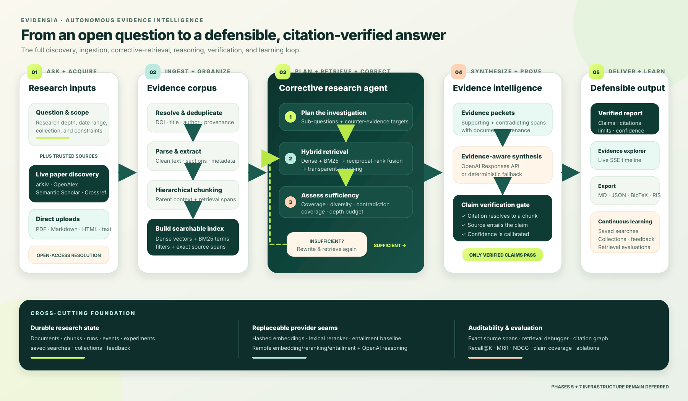

# Evidensia architecture and research flow

Evidensia turns an open-ended research question into a traceable report whose claims can be inspected against exact source passages. The system keeps paper acquisition, retrieval, reasoning, verification, and evaluation as separate stages so each decision remains observable and replaceable.



## End-to-end execution

1. **Ask and scope.** A researcher supplies a question, research depth, date range, and optional collection. The same workspace can accept local PDF, Markdown, HTML, and text files.
2. **Discover sources.** Evidensia searches arXiv, OpenAlex, Semantic Scholar, and Crossref. It normalizes provider records, deduplicates by DOI and paper identity, and uses Unpaywall when a DOI can be resolved to a lawful open-access copy.
3. **Build the corpus.** Documents are parsed, enriched with deterministic metadata, divided into section-aware parent and retrieval chunks, and added to the local dense and BM25 indexes. Every chunk retains its document and source-span provenance.
4. **Recall, plan, and retrieve.** When Mem0 and a user ID are configured, Evidensia recalls relevant prior context before the LangGraph workflow decomposes the question into sub-questions and counter-evidence targets. Each query uses dense retrieval and BM25, reciprocal-rank fusion, and transparent reranking. Recalled memory can guide scope and query expansion but never enters the evidence set.
5. **Correct weak retrieval.** A sufficiency gate evaluates coverage, source diversity, contradiction coverage, and the selected depth budget. If the evidence is incomplete, the agent rewrites the uncovered queries and retrieves again until evidence is sufficient or the correction budget is exhausted.
6. **Synthesize and verify.** Supporting and contradicting passages become bounded evidence packets. When configured, the OpenAI research provider plans, synthesizes, verifies, and composes through strict JSON schemas; any refusal, timeout, invalid response, or provider error falls back to deterministic reasoning. Citation resolution and entailment checks gate every proposed claim.
7. **Deliver, remember, and improve.** The Research Studio streams the run timeline, exposes source passages, and exports Markdown, JSON, BibTeX, or RIS. Successful citation-verified summaries can be written to user-scoped Mem0 memory for future runs. Saved searches, collections, feedback, retrieval debugging, citation graphs, experiments, and ablations support repeatable improvement.

## Runtime architecture

| Layer | Responsibility | Main implementation |
|---|---|---|
| Research Studio | Question entry, paper discovery, source library, evidence explorer, retrieval debugger, and evaluations | `apps/web/app/page.tsx` |
| FastAPI boundary | Validated APIs, SSE research events, CORS, provider manifest, imports, exports, and evaluation routes | `src/evidensia/api.py` |
| Scholarly connectors | Provider-specific discovery and metadata normalization | `src/evidensia/connectors/` |
| Knowledge service | Parsing, metadata extraction, hierarchical chunking, indexing, and durable document records | `src/evidensia/services/knowledge.py` |
| Retrieval pipeline | Query analysis, dense and BM25 retrieval, reciprocal-rank fusion, and reranking | `src/evidensia/retrieval/` |
| Research graph | Plan → retrieve → assess → rewrite loop → synthesize → verify | `src/evidensia/graph/research.py` |
| Reasoning providers | OpenAI structured reasoning with deterministic fallbacks | `src/evidensia/agents/` |
| Persistence, memory, and exports | Documents, runs, events, searches, collections, feedback, experiments, optional Mem0 long-term memory, and report formats | `src/evidensia/persistence.py`, `src/evidensia/services/memory.py`, `src/evidensia/services/exports.py` |

## Corrective research state machine

The graph has six validated nodes:

```text
START → plan → retrieve → assess ── sufficient ─→ synthesize → verify → END
                              └── insufficient ─→ rewrite ─→ retrieve
```

The correction loop is deliberately bounded. A run may stop rewriting when it reaches its depth-specific iteration budget, then synthesize only from the evidence that was actually retrieved. The final report carries limitations and verification results rather than silently presenting unsupported certainty.

## Data and model boundaries

- Scholarly providers receive the discovery query and date/provider filters required for search.
- Imported content and research state remain in the configured local `EVIDENSIA_DATA_DIR`.
- When `OPENAI_API_KEY` is configured, only the bounded evidence context needed for planning, synthesis, verification, or report composition is sent to the selected research model.
- When `MEM0_API_KEY` and a research `user_id` are configured, relevant user-scoped memories are retrieved for planning and verified result summaries are queued for write-back. They are never accepted as evidence or citations.
- Without an OpenAI key—or after any model failure—the research graph stays operational through deterministic planning, lexical reranking, lexical entailment, and report generation.
- Embedding, reranking, and entailment providers are independently configurable and reported by `GET /v1/providers`.

## Persistence and observability

The default development store lives under `.evidensia_data` and survives API restarts. It contains document manifests and content plus SQLite-backed research runs, event timelines, saved searches, collections, feedback, and experiment results. The Research Studio consumes server-sent events while a run is active, and every completed run can be inspected or exported later.

## Local process topology

```text
Browser / hosted Research Studio
            │
            │ HTTP + SSE
            ▼
FastAPI on 127.0.0.1:8002
   ├── local corpus and SQLite state
   ├── scholarly discovery APIs
   ├── optional Unpaywall PDF resolution
   ├── optional OpenAI Responses API
   └── optional Mem0 Platform memory API
```

The web app reads `NEXT_PUBLIC_API_URL`, defaulting to `http://127.0.0.1:8002`. CORS includes the normal local development origins and the private Evidensia Sites origin; additional origins can be supplied through `EVIDENSIA_CORS_ORIGINS`.

## Scope boundary

The current repository implements the research product and local durable runtime. Phase 5 production infrastructure and Phase 7 large-scale deployment from the source system design remain intentionally deferred.
